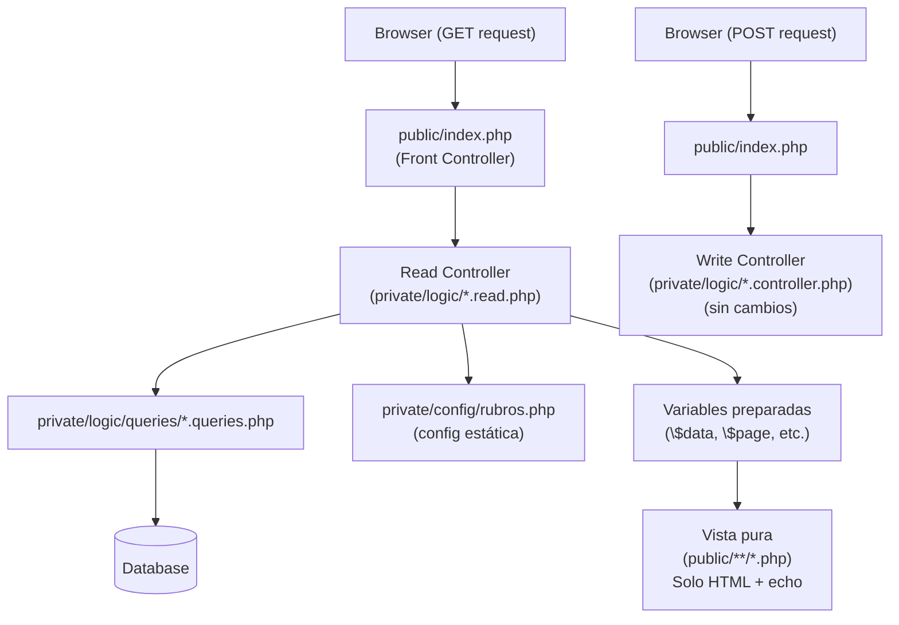
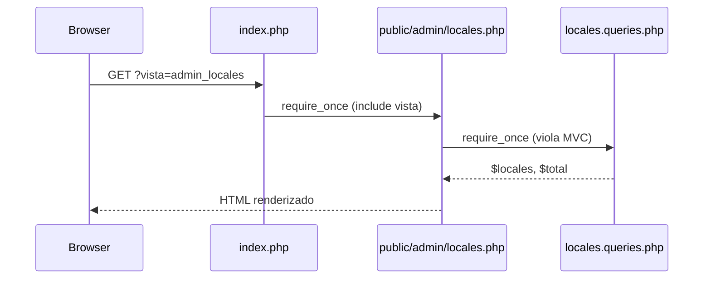
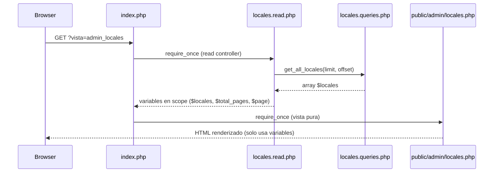

# Design Document: mvc-view-controllers

## Overview

Actualmente las vistas en `public/` importan directamente desde `private/logic/queries/` para obtener sus datos, saltándose el dispatcher central (`index.php`). Esta refactorización introduce controladores de lectura (GET) por módulo y extiende `index.php` para que prepare los datos antes de incluir cada vista, eliminando todos los `require` a `private/` desde las vistas.

El patrón resultante es: `index.php` actúa como front controller único — recibe la request GET, invoca el controlador de lectura correspondiente que popula variables, y luego incluye la vista que solo renderiza HTML.

## Architecture



## Sequence Diagrams

### Flujo GET actual (problemático)



### Flujo GET objetivo (correcto)



## Components and Interfaces

### Controladores de lectura (nuevos)

Cada archivo en `private/logic/` con sufijo `.read.php` es responsable de preparar las variables que su módulo necesita. Se ejecutan en el scope de `index.php` (via `require_once`), por lo que las variables quedan disponibles para la vista.

**Convención de naming:** `private/logic/{modulo}.read.php`

#### `locales.read.php`

Prepara datos para vistas: `admin_locales`, `admin_local_agregar`, `admin_local_editar`, `landing`, `locales`, `promociones` (client).

```php
// Variables que expone al scope de index.php según $vista:
// admin_locales:      $locales, $total_pages, $page
// admin_local_agregar: $duenos, $rubros
// admin_local_editar:  $local, $duenos, $rubros
// landing:             $locales (top 4 solicitados)
// locales:             $locales, $rubros, $total_pages, $page
// promociones:         $local, $promos, $total_pages, $page, $categorias
```

#### `novedades.read.php`

Prepara datos para vistas: `admin_novedades`, `admin_novedad_agregar`, `admin_novedad_editar`, `novedades`.

```php
// admin_novedades:      $novedades, $total_pages, $page
// admin_novedad_agregar: $categorias
// admin_novedad_editar:  $novedad, $categorias
// novedades:             $novedades, $total_pages, $page
```

#### `promociones.read.php`

Prepara datos para vistas: `admin_promociones`, `dueno_promociones`, `dueno_solicitudes`, `dueno_reportes`, `cliente_promociones`.

```php
// admin_promociones:   $promociones, $total_pages, $page
// dueno_promociones:   $promociones, $total_pages, $page
// dueno_solicitudes:   $solicitudes, $total_pages, $page
// dueno_reportes:      $reporte
// cliente_promociones: $mis_promociones, $total_pages, $page
```

#### `usuarios.read.php`

Prepara datos para vistas: `admin_aprobar_clientes`, `admin_aprobar_duenos`, `cliente_perfil`, `cliente_mod_perfil`.

```php
// admin_aprobar_clientes: $usuarios_pendientes
// admin_aprobar_duenos:   $duenos_pendientes
// cliente_perfil:         $user, $total_promos_usadas
// cliente_mod_perfil:     $user
```

### Vistas (sin cambios de lógica, solo eliminación de requires)

Las vistas pasan a ser HTML puro con `echo` de variables. Se elimina todo `require_once` que apunte a `private/`. Los `include` de `includes/header.php`, `footer.php`, etc. se mantienen (son de `public/` o `includes/`, no de `private/`).

### `public/index.php` extendido

El switch GET se extiende para llamar al read controller antes de incluir la vista:

```php
// Patrón para cada case:
case 'admin_locales':
    require_once __DIR__ . '/../private/logic/locales.read.php';
    require_once __DIR__ . '/admin/locales.php';
    break;
```

## Data Models

### Contrato de variables por vista

Cada read controller debe garantizar que las variables estén definidas antes de que la vista las use. Si una query falla, debe retornar array vacío o null (nunca undefined).

```php
// Ejemplo de contrato para admin_locales:
// $locales      : array   — resultado de get_all_locales() o []
// $total_pages  : int     — mínimo 1
// $page         : int     — mínimo 1
```

### `rubros.php` — decisión de diseño

`private/config/rubros.php` es configuración estática (no hace queries). Se tolera que los read controllers la incluyan internamente cuando la necesiten. Las vistas **no** la importan directamente.

```php
// En locales.read.php (cuando $vista requiere rubros):
require_once __DIR__ . '/../config/rubros.php'; // $rubros disponible
```

## Decisiones de diseño para archivos problemáticos

### `public/darAltaPromos.php`

Este archivo es un duplicado funcional de `public/dueno/promocion_agregar.php` (que ya usa el dispatcher correctamente). Además su `<form>` apunta a `../private/logic/crud/promociones.php` que ya no existe tras el refactor anterior.

**Decisión:** Eliminar `darAltaPromos.php`. Redirigir cualquier enlace que apunte a él hacia `index.php?vista=dueno_promocion_agregar`.

### `public/reportesDueño.php`

Contiene SQL directo, lógica de generación de PDF y renderizado HTML mezclados. La funcionalidad de reporte ya existe en `public/dueno/reportes.php` (usa queries) y la generación de PDF ya existe en `private/logic/reports/generarInforme.php`.

**Decisión:** Eliminar `reportesDueño.php`. La vista `public/dueno/reportes.php` ya cubre el reporte básico. La generación de PDF se mantiene en `private/logic/reports/` y se accede via el dispatcher existente en `admin/locales.php` (fetch a `check_promociones.php` + redirect a `generarInforme.php`). Si se necesita PDF para dueño, se agrega una acción POST en `dueno.controller.php`.

## Algorithmic Pseudocode

### Algoritmo principal: index.php GET dispatcher extendido

```pascal
ALGORITHM dispatch_get_request(vista, get_params)
INPUT: vista: string, get_params: array
OUTPUT: HTML renderizado al browser

BEGIN
  // 1. Determinar qué read controller necesita esta vista
  read_controller ← map_vista_to_read_controller(vista)
  
  // 2. Si la vista requiere autenticación, verificar sesión
  IF vista_requires_auth(vista) THEN
    IF NOT session_valid() THEN
      redirect("index.php?vista=login")
      EXIT
    END IF
    IF NOT user_has_role(vista) THEN
      redirect("index.php")
      EXIT
    END IF
  END IF
  
  // 3. Ejecutar read controller (popula variables en scope)
  IF read_controller IS NOT NULL THEN
    require_once(read_controller)
    // Variables como $locales, $page, $total_pages ahora en scope
  END IF
  
  // 4. Incluir vista (solo renderiza con variables ya disponibles)
  require_once(map_vista_to_file(vista))
END
```

### Algoritmo: read controller genérico

```pascal
ALGORITHM execute_read_controller(vista, get_params, session)
INPUT: vista: string, get_params: array, session: array
OUTPUT: variables en scope del caller

BEGIN
  // Paginación común
  limit  ← DEFAULT_LIMIT  // ej: 10
  page   ← max(1, intval(get_params['page'] ?? 1))
  offset ← (page - 1) * limit

  SWITCH vista
    CASE 'admin_locales':
      $locales     ← get_all_locales(limit, offset)
      $total       ← get_total_locales()
      $total_pages ← max(1, ceil(total / limit))
      $page        ← page

    CASE 'admin_local_editar':
      id_local ← intval(get_params['id'] ?? 0)
      IF id_local <= 0 THEN
        redirect("index.php?vista=admin_locales")
        EXIT
      END IF
      $local  ← get_local(id_local)
      $duenos ← get_all_duenos()
      require rubros.php  // $rubros

    CASE 'landing':
      $locales ← get_locales_solicitados()

    // ... demás casos
  END SWITCH
END
```

## Key Functions with Formal Specifications

### `locales.read.php` — case `admin_locales`

**Preconditions:**
- `$_SESSION['user_tipo'] === 'Administrador'` (verificado antes en index.php)
- `$_GET['page']` es entero positivo o no está definido

**Postconditions:**
- `$locales` es array (puede ser vacío, nunca undefined)
- `$page >= 1`
- `$total_pages >= 1`
- No hay side effects (solo lectura)

### `locales.read.php` — case `admin_local_editar`

**Preconditions:**
- `$_GET['id']` es entero positivo válido
- El local con ese id existe en DB

**Postconditions:**
- `$local` es array con datos del local o redirect si no existe
- `$duenos` es array de usuarios tipo Dueño
- `$rubros` es array de strings (de rubros.php)

**Loop Invariants:** N/A (no hay loops en el read controller)

### `usuarios.read.php` — case `cliente_perfil`

**Preconditions:**
- `$_SESSION['user_id']` está definido y es entero positivo

**Postconditions:**
- `$user` es array con datos del usuario o redirect a login si no existe
- `$total_promos_usadas` es entero >= 0

## Example Usage

### Antes (violación MVC)

```php
// public/admin/locales.php — ANTES
require_once __DIR__ . '/../../private/logic/queries/locales.queries.php';  // ← ELIMINAR
require_once __DIR__ . '/../../private/logic/queries/usuarios.queries.php'; // ← ELIMINAR

$locales = get_all_locales($limit, $offset); // ← ELIMINAR
```

### Después (correcto)

```php
// public/index.php — case extendido
case 'admin_locales':
    require_once __DIR__ . '/../private/logic/locales.read.php'; // prepara $locales, $page, $total_pages
    require_once __DIR__ . '/admin/locales.php';                 // solo renderiza
    break;

// private/logic/locales.read.php
// (fragmento para admin_locales)
$limit       = 10;
$page        = max(1, (int)($_GET['page'] ?? 1));
$offset      = ($page - 1) * $limit;
$locales     = get_all_locales($limit, $offset);
$total       = get_total_locales();
$total_pages = max(1, (int)ceil($total / $limit));

// public/admin/locales.php — DESPUÉS
// Sin ningún require a private/. Solo usa $locales, $page, $total_pages.
foreach ($locales as $local) { ... }
```

## Correctness Properties

- Para toda vista GET despachada por `index.php`, no existe ningún `require`/`include` hacia `private/logic/queries/` ni `private/config/` dentro del archivo de vista.
- Para todo read controller, si la query retorna false o null, la variable correspondiente es array vacío o valor por defecto (nunca causa un error de "variable undefined" en la vista).
- Para toda vista que requiere autenticación, el read controller no se ejecuta si la sesión no es válida (la verificación ocurre en index.php antes del require del read controller).
- `rubros.php` solo es incluido desde read controllers o desde `index.php`, nunca desde archivos en `public/`.
- `darAltaPromos.php` y `reportesDueño.php` son eliminados del proyecto; no existe ninguna referencia activa a ellos.

## Error Handling

### Vista solicitada con ID inválido (ej: `admin_local_editar` sin `?id=`)

**Condición:** `$_GET['id']` ausente o no entero positivo  
**Respuesta:** El read controller hace redirect a la lista (`index.php?vista=admin_locales`) con `$_SESSION['error']`  
**Recovery:** El usuario ve el mensaje de error en la lista

### Query falla (DB no disponible)

**Condición:** La función de query retorna `false` o array vacío  
**Respuesta:** El read controller asigna array vacío a la variable; la vista muestra mensaje "No hay datos"  
**Recovery:** No hay crash; la vista renderiza con estado vacío

### Vista inexistente en el switch

**Condición:** `$_GET['vista']` no coincide con ningún case  
**Respuesta:** El `default` del switch redirige a `landing`  
**Recovery:** El usuario llega al inicio

## Testing Strategy

### Unit Testing Approach

Cada read controller puede testearse de forma aislada mockeando las funciones de queries. Se verifica que las variables correctas queden definidas en scope para cada `$vista`.

### Property-Based Testing Approach

**Property Test Library:** No aplica directamente (PHP sin framework de PBT). Las propiedades se verifican con tests de integración.

Propiedades clave a verificar:
- Para cualquier `$vista` válida, el read controller nunca lanza excepciones no capturadas
- Para cualquier `$_GET['page']` (incluyendo negativos, strings, null), `$page >= 1` y `$offset >= 0`

### Integration Testing Approach

Smoke tests HTTP para cada ruta GET:
- Verificar HTTP 200 para rutas autenticadas (con sesión mockeada)
- Verificar HTTP 302 para rutas autenticadas sin sesión
- Verificar que el HTML resultante no contiene trazas de error PHP

## Security Considerations

- La verificación de rol/sesión permanece en `index.php` antes de invocar el read controller. Los read controllers no verifican sesión por sí mismos (single responsibility).
- Los read controllers solo hacen lectura (SELECT). No procesan `$_POST`.
- Todos los parámetros GET usados en queries pasan por `filter_input(INPUT_GET, ..., FILTER_VALIDATE_INT)` o `intval()`.

## Dependencies

- `private/logic/queries/*.queries.php` — funciones de lectura existentes (sin cambios)
- `private/config/rubros.php` — config estática (sin cambios)
- `private/config/database.php` — ya incluido por las queries (sin cambios)
- `public/index.php` — se extiende el switch GET
- Vistas en `public/**/*.php` — se eliminan sus `require` a `private/`
