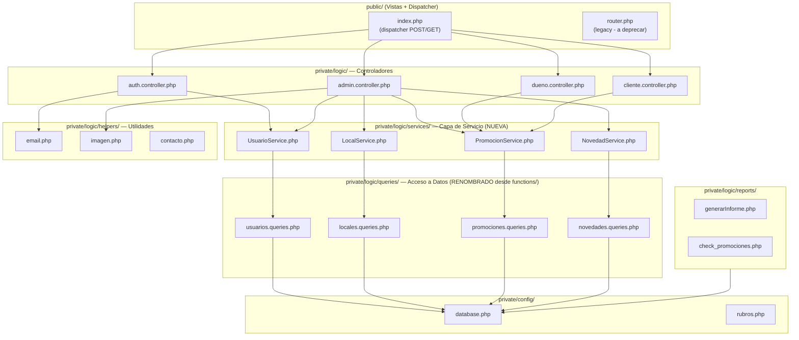
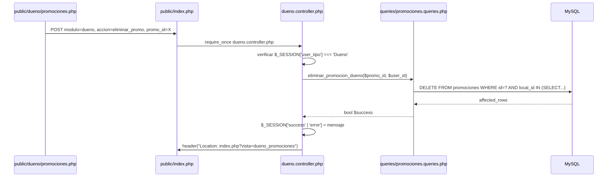

# Design Document: Refactorización de `private/`

## Overview

La carpeta `private/` contiene la lógica de negocio del proyecto PHP. El problema central es que las responsabilidades están mal distribuidas: existen dos capas paralelas que hacen lo mismo (`crud/` y `functions/`), hay archivos legacy que quedaron huérfanos (`aceptar_clientes.php`, `aceptar_dueños.php`), y los controladores mezclan lógica de negocio con acceso directo a la base de datos. El objetivo de esta refactorización es consolidar esas capas, eliminar redundancias y dejar cada archivo con una única responsabilidad clara, sin romper los `require` que ya funcionan en `public/`.

La estrategia es trabajar controlador por controlador, validando que cada módulo siga funcionando antes de pasar al siguiente. No se agregan features nuevas, solo se reorganiza lo existente.

---

## Architecture



---

## Diagnóstico: Problemas Actuales

### 1. Duplicación entre `crud/` y `functions/`

La misma lógica de negocio existe en dos lugares distintos:

| Operación | En `crud/` | En `functions/` |
|---|---|---|
| Promociones del dueño | `crud/promociones.php::crear_promocion()` | `functions/functions_dueno.php::get_promociones_dueno()` |
| Eliminar promoción | `dueno.controller.php::procesar_eliminar_promo()` (SQL directo) | `crud/promociones.php::eliminar_promocion()` |
| Aprobar usuario | `crud/usuarios.php::aprobar_dueno()` | `admin.controller.php::procesar_estado_usuario()` (SQL directo) |
| Crear local | `crud/locales.php::crear_local()` | `admin.controller.php::procesar_crear_local()` (via `ob_start` + `include`) |

### 2. Patrón `ob_start` + `include` en `admin.controller.php`

`admin.controller.php` usa `ob_start()` para capturar la salida de los archivos `crud/` e inferir éxito/error por el texto del output. Esto es frágil y debe eliminarse.

```php
// PATRÓN A ELIMINAR — admin.controller.php
ob_start();
include(__DIR__ . '/crud/locales.php');
$response = ob_get_clean();
if (stripos($response, "exito") !== false) { ... }
```

### 3. Archivos legacy huérfanos

- `private/logic/aceptar_clientes.php` — redirige a `../admin_aprobar_clientes.php` (ruta que ya no existe)
- `private/logic/aceptar_dueños.php` — mismo problema
- `private/logic/scripts/generar_hash.php` — script de utilidad de desarrollo, no debe estar en producción
- `public/router.php` — dispatcher alternativo que ya fue reemplazado por `index.php`

### 4. SQL directo en controladores

`dueno.controller.php` y `admin.controller.php` ejecutan queries directamente en lugar de delegar a la capa de datos:

```php
// dueno.controller.php — SQL directo a eliminar
$stmt = $conn->prepare("DELETE FROM promociones WHERE id = ?");
```

### 5. Duplicación en `functions_dueno.php` vs `functions_promociones.php`

`get_promociones_dueno()` y `get_total_promociones_dueno()` existen en **ambos** archivos con implementaciones idénticas.

---

## Estructura Objetivo

```
private/
├── config/
│   ├── database.php          (sin cambios)
│   └── rubros.php            (sin cambios)
├── lib/                      (sin cambios)
├── bd/                       (sin cambios)
└── logic/
    ├── auth.controller.php   (refactorizado)
    ├── admin.controller.php  (refactorizado — eliminar ob_start)
    ├── dueno.controller.php  (refactorizado — eliminar SQL directo)
    ├── cliente.controller.php(sin cambios funcionales)
    ├── queries/              (RENOMBRADO desde functions/ + absorbe crud/)
    │   ├── usuarios.queries.php
    │   ├── locales.queries.php
    │   ├── promociones.queries.php
    │   └── novedades.queries.php
    ├── helpers/
    │   ├── email.php         (sin cambios)
    │   ├── imagen.php        (renombrado desde subirImagen.php + absorbe visualizar_imagen.php)
    │   ├── contacto.php      (renombrado desde procesar_contacto.php)
    │   └── visualizar_imagen.php (mantener por compatibilidad con index.php)
    └── reports/
        ├── check_promociones.php  (sin cambios)
        └── generarInforme.php     (sin cambios)
```

**Archivos a eliminar:**
- `private/logic/aceptar_clientes.php`
- `private/logic/aceptar_dueños.php`
- `private/logic/scripts/generar_hash.php`
- `private/logic/crud/` (carpeta completa, lógica absorbida por `queries/`)
- `private/logic/functions/` (carpeta completa, renombrada a `queries/`)

---

## Componentes y Responsabilidades

### Controladores (`*.controller.php`)

**Responsabilidad única**: Recibir la acción HTTP, validar permisos, delegar a la capa de queries, y redirigir.

**NO deben contener**: SQL, lógica de negocio compleja, `ob_start`.

```php
// Interfaz esperada de un controlador
// - Lee $_POST['accion']
// - Verifica $_SESSION para permisos
// - Llama funciones de queries/
// - Setea $_SESSION['success'] o $_SESSION['error']
// - Hace header("Location: ...")
```

### Capa de Queries (`queries/*.queries.php`)

**Responsabilidad única**: Toda interacción con la base de datos. Funciones puras que reciben parámetros y devuelven datos o bool.

**NO deben contener**: Lógica de sesión, redirecciones, validaciones de negocio.

```php
// Contrato de una función de queries
// INPUT:  parámetros tipados (int $id, string $email, etc.)
// OUTPUT: array|bool|int|null — nunca void con side effects de sesión
// NEVER:  header(), $_SESSION, $_POST, $_GET
```

### Helpers (`helpers/`)

**Responsabilidad única**: Utilidades transversales (email, imágenes). Sin dependencia de sesión ni de lógica de negocio.

---

## Secuencia de Flujo: Ejemplo Refactorizado (Eliminar Promoción — Dueño)



---

## Plan de Refactorización por Módulo

El trabajo se hace controlador por controlador. Cada paso debe dejar el sistema funcionando antes de continuar.

### Paso 1: Eliminar archivos legacy (sin riesgo)

Archivos a borrar que no tienen ningún `require` activo apuntando a ellos:
- `private/logic/aceptar_clientes.php`
- `private/logic/aceptar_dueños.php`
- `private/logic/scripts/generar_hash.php`

**Verificación**: Buscar con `grep -r "aceptar_clientes\|aceptar_dueños\|generar_hash" public/` — debe dar vacío.

### Paso 2: Crear `queries/` consolidando `functions/` + `crud/`

Crear la carpeta `private/logic/queries/` con cuatro archivos. Cada archivo absorbe las funciones de su `functions_*.php` correspondiente más las funciones SQL de su `crud/*.php`.

**Regla de consolidación**:
- Si la misma query existe en `functions/` y en `crud/`, se mantiene **una sola versión** en `queries/`.
- La versión a mantener es la que tiene mejor manejo de errores (generalmente la de `functions/`).
- Las funciones que hacen redirecciones en `crud/` se dividen: la lógica SQL va a `queries/`, la redirección queda en el controlador.

**Caso concreto — `get_promociones_dueno` duplicada:**

```php
// functions_dueno.php — versión A (MANTENER esta)
function get_promociones_dueno($usuario_id, $limit, $offset) { ... }

// functions_promociones.php — versión B (ELIMINAR)
function get_promociones_dueno($user_id, $limit, $offset) { ... }
// Idéntica lógica, diferente nombre de parámetro. Eliminar la de functions_promociones.php.
```

**Mapa de consolidación:**

| Archivo origen | Destino en `queries/` |
|---|---|
| `functions/functions_usuarios.php` | `queries/usuarios.queries.php` |
| `functions/functions_locales.php` | `queries/locales.queries.php` |
| `functions/functions_promociones.php` | `queries/promociones.queries.php` |
| `functions/functions_novedades.php` | `queries/novedades.queries.php` |
| `functions/functions_dueno.php` | Se divide: queries de promociones → `promociones.queries.php`, queries de locales → `locales.queries.php` |
| `crud/usuarios.php` (funciones SQL) | `queries/usuarios.queries.php` |
| `crud/locales.php` (funciones SQL) | `queries/locales.queries.php` |
| `crud/promociones.php` (funciones SQL) | `queries/promociones.queries.php` |
| `crud/novedades.php` (funciones SQL) | `queries/novedades.queries.php` |

### Paso 3: Refactorizar `admin.controller.php`

Eliminar el patrón `ob_start` + `include`. Reemplazar cada función que lo usa por llamadas directas a `queries/`.

```php
// ANTES (frágil)
function procesar_crear_local() {
    $_POST['action'] = 'create';
    ob_start();
    include(__DIR__ . '/crud/locales.php');
    $response = ob_get_clean();
    if (stripos($response, "exito") !== false) { ... }
}

// DESPUÉS (directo)
function procesar_crear_local() {
    // validaciones...
    $resultado = crear_local_query($nombre, $ubicacion, $rubro, $idUsuario, $imagen_tmp);
    if ($resultado) {
        $_SESSION['success'] = "Local creado exitosamente.";
        header("Location: index.php?vista=admin_locales");
    } else {
        $_SESSION['error'] = "Error al registrar el local.";
        header("Location: index.php?vista=admin_local_agregar");
    }
    exit();
}
```

### Paso 4: Refactorizar `dueno.controller.php`

Mover el SQL directo a `queries/promociones.queries.php`.

```php
// ANTES — SQL directo en el controlador
function procesar_eliminar_promo() {
    $conn = getDB();
    $stmt = $conn->prepare("DELETE FROM promociones WHERE id = ?");
    ...
}

// DESPUÉS — delega a queries
function procesar_eliminar_promo() {
    $promo_id = intval($_POST['promo_id'] ?? 0);
    if (eliminar_promocion_dueno($promo_id, $_SESSION['user_id'])) {
        $_SESSION['success'] = "Promoción eliminada correctamente.";
    } else {
        $_SESSION['error'] = "Error al eliminar la promoción.";
    }
    header("Location: index.php?vista=dueno_promociones");
    exit();
}
```

### Paso 5: Refactorizar `auth.controller.php`

El único problema aquí es `procesar_registro()`, que usa `ob_start` + `include` de `crud/usuarios.php`. Reemplazar por llamada directa a `queries/usuarios.queries.php`.

```php
// ANTES
ob_start();
include(__DIR__ . '/crud/usuarios.php');
$response = ob_get_clean();
if (stripos($response, "exitoso") !== false) { ... }

// DESPUÉS
$resultado = ($tipo === 'Cliente')
    ? registrar_cliente_query($email, $password)
    : registrar_dueno_query($email, $password);

if ($resultado['success']) {
    $_SESSION['success'] = $resultado['message'];
} else {
    $_SESSION['error'] = $resultado['message'];
}
```

### Paso 6: Actualizar todos los `require_once` en `public/`

Una vez que `queries/` existe y `functions/` se elimina, actualizar los `require_once` en las vistas de `public/`.

**Búsqueda de requires a actualizar:**

```
grep -r "functions_locales\|functions_usuarios\|functions_dueno\|functions_promociones\|functions_novedades" public/
```

**Mapa de cambios en `public/`:**

| Vista | `require` actual | `require` nuevo |
|---|---|---|
| `public/admin/locales.php` | `functions/functions_locales.php` | `queries/locales.queries.php` |
| `public/admin/locales.php` | `functions/functions_usuarios.php` | `queries/usuarios.queries.php` |
| `public/admin/local_agregar.php` | (verificar) | `queries/locales.queries.php` |
| `public/admin/local_editar.php` | (verificar) | `queries/locales.queries.php` |
| `public/admin/novedades.php` | `functions/functions_novedades.php` | `queries/novedades.queries.php` |
| `public/admin/promociones.php` | (verificar) | `queries/promociones.queries.php` |
| `public/admin/aprobar_clientes.php` | `functions/functions_usuarios.php` | `queries/usuarios.queries.php` |
| `public/admin/aprobar_duenos.php` | `functions/functions_usuarios.php` | `queries/usuarios.queries.php` |
| `public/dueno/promociones.php` | `functions/functions_dueno.php` | `queries/promociones.queries.php` |
| `public/dueno/solicitudes.php` | `functions/functions_dueno.php` | `queries/promociones.queries.php` |
| `public/dueno/reportes.php` | `functions/functions_dueno.php` | `queries/promociones.queries.php` |
| `public/client/miperfil.php` | `functions/functions_usuarios.php` | `queries/usuarios.queries.php` |
| `public/client/mis_promociones.php` | `functions/functions_promociones.php` | `queries/promociones.queries.php` |
| `public/client/promociones.php` | `functions/functions_promociones.php` | `queries/promociones.queries.php` |
| `public/locales.php` | `functions/functions_locales.php` | `queries/locales.queries.php` |
| `public/novedades.php` | `functions/functions_novedades.php` | `queries/novedades.queries.php` |
| `public/landing.php` | (verificar) | según corresponda |

### Paso 7: Deprecar `public/router.php`

`public/router.php` es un dispatcher alternativo que apunta a `crud/`. Una vez que `crud/` se elimina, `router.php` queda sin destino. Verificar que ninguna vista lo use y eliminarlo.

```
grep -r "router.php" public/
```

---

## Interfaces de las Capas de Queries

### `queries/usuarios.queries.php`

```php
// Lectura
function get_usuario(int $id): ?array
function get_dueño(int $idUsuario): ?array
function get_dueño_by_email(string $email): ?array
function get_all_dueños(): array
function get_usuarios_pendientes(string $tipo, int $limit, int $offset): array
function get_total_usuarios_pendientes(string $tipo): int
function get_categorias(): array
function get_total_promociones_usadas_cliente(int $usuario_id): int

// Escritura — devuelven ['success' => bool, 'message' => string]
function registrar_cliente_query(string $email, string $password): array
function registrar_dueno_query(string $email, string $password): array
function validar_token_query(string $token): array
function aprobar_usuario_query(int $id, string $tipo): bool
function rechazar_usuario_query(int $id): bool
function cambiar_password_query(int $id, string $nueva_password): bool
function cambiar_password_por_email_query(string $email, string $nueva_password): bool
```

### `queries/locales.queries.php`

```php
// Lectura
function get_all_locales(?int $limit, ?int $offset): array
function get_local(int $id_local): ?array
function get_local_by_nombre(string $nombre): ?array
function get_total_locales(): int
function get_locales_solicitados(): array
function get_locales_por_dueno(int $usuario_id): array

// Escritura
function crear_local_query(string $nombre, string $ubicacion, string $rubro, int $idUsuario, ?string $imagen_tmp): bool
function actualizar_local_query(int $id, string $nombre, string $ubicacion, string $rubro, int $idUsuario, ?string $imagen_tmp): bool
function eliminar_local_query(int $id): bool
```

### `queries/promociones.queries.php`

```php
// Lectura
function get_all_promociones_activas(): array
function get_promociones_pendientes(int $limit, int $offset): array
function get_total_promociones_pendientes(): int
function get_promociones_by_local(int $local_id, int $limit, int $offset): array
function get_total_promociones_by_local(int $local_id): int
function get_promociones_cliente(int $usuario_id, int $limit, int $offset): array
function get_total_promociones_cliente(int $usuario_id): int
function get_promociones_dueno(int $usuario_id, int $limit, int $offset): array
function get_total_promociones_dueno(int $usuario_id): int
function get_solicitudes_dueno(int $usuario_id, int $limit, int $offset): array
function get_total_solicitudes_dueno(int $usuario_id): int
function get_reporte_promos_dueno(int $usuario_id): array
function ya_pidio_promocion(int $usuario_id, int $promo_id): bool

// Escritura
function crear_promocion_query(int $local_id, string $texto, string $fecha_inicio, string $fecha_fin, string $dias, string $categoria): bool
function eliminar_promocion_dueno(int $promo_id, int $usuario_id): bool
function eliminar_promocion_admin(int $promo_id): bool
function aprobar_promocion_query(int $promo_id): bool
function rechazar_promocion_query(int $promo_id): bool
function gestionar_solicitud_query(int $promo_id, int $cliente_id, string $estado): bool
function pedir_promocion(int $usuario_id, int $promo_id): array
```

### `queries/novedades.queries.php`

```php
// Lectura
function get_all_novedades(?int $limit, ?int $offset): array
function get_novedad(int $id): ?array
function get_total_novedades(): int
function get_novedades_permitidas(int $id_usuario, string $tipo_usuario, string $categoria_usuario): array
function mesEnEspañol(string $mesIngles): string

// Escritura
function crear_novedad_query(string $titulo, string $texto, string $fecha_desde, string $fecha_hasta, string $categoria, ?string $imagen_tmp): bool
function actualizar_novedad_query(int $id, string $titulo, string $texto, string $fecha_desde, string $fecha_hasta, string $categoria, ?string $imagen_tmp): bool
function eliminar_novedad_query(int $id): bool
```

---

## Manejo de Errores

### Convención de retorno para funciones de escritura

Las funciones de escritura en `queries/` deben seguir esta convención:

```php
// Para operaciones simples (DELETE, UPDATE sin lógica de negocio)
// Retornar bool
function eliminar_local_query(int $id): bool {
    $conn = getDB();
    $stmt = $conn->prepare("DELETE FROM locales WHERE id = ?");
    $stmt->bind_param("i", $id);
    $result = $stmt->execute();
    $stmt->close();
    return $result;
}

// Para operaciones con validaciones de negocio (registro, etc.)
// Retornar array ['success' => bool, 'message' => string]
function registrar_cliente_query(string $email, string $password): array {
    // ... validaciones ...
    if ($email_existe) {
        return ['success' => false, 'message' => 'El email ya está registrado.'];
    }
    // ... insert ...
    return ['success' => true, 'message' => 'Registro exitoso.'];
}
```

### Logging

Mantener `error_log()` en todas las funciones de queries donde ya existe. No agregar ni quitar.

---

## Consideraciones de Seguridad

- Los controladores deben mantener la verificación de `$_SESSION['user_tipo']` al inicio, antes de cualquier operación.
- Las funciones de `queries/` **no** verifican sesión — esa responsabilidad es exclusiva del controlador.
- `check_promociones.php` y `generarInforme.php` en `reports/` tienen su propia verificación de sesión porque son endpoints directos (llamados via fetch/URL directa). Mantener esa verificación.
- `procesar_contacto.php` en `helpers/` también es un endpoint directo. Mantener su `session_start()`.

---

## Orden de Ejecución Recomendado

```
1. Paso 1: Eliminar legacy (5 min, cero riesgo)
2. Paso 2: Crear queries/ con los 4 archivos consolidados
3. Paso 3: Refactorizar admin.controller.php
4. Paso 4: Refactorizar dueno.controller.php
5. Paso 5: Refactorizar auth.controller.php
6. Paso 6: Actualizar requires en public/
7. Paso 7: Eliminar functions/ y crud/ (solo cuando todos los requires estén actualizados)
8. Paso 8: Deprecar router.php
```

Cada paso termina con una verificación manual en el navegador del flujo correspondiente antes de continuar.
